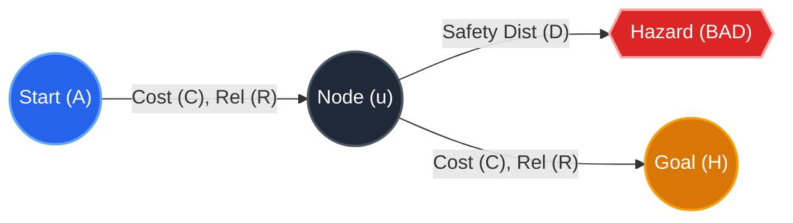
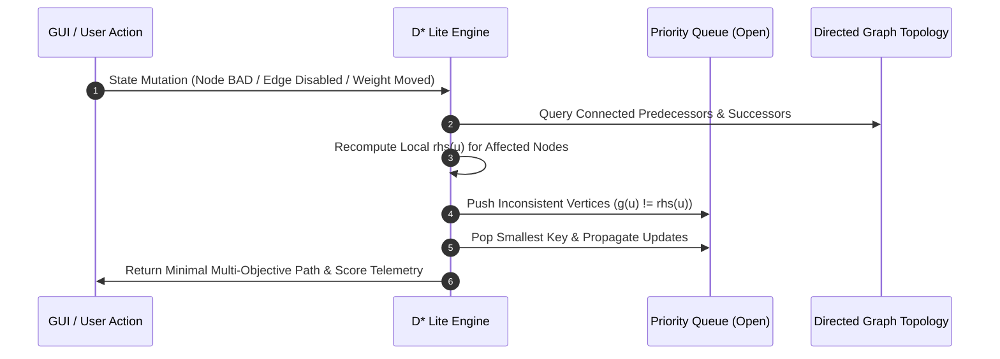
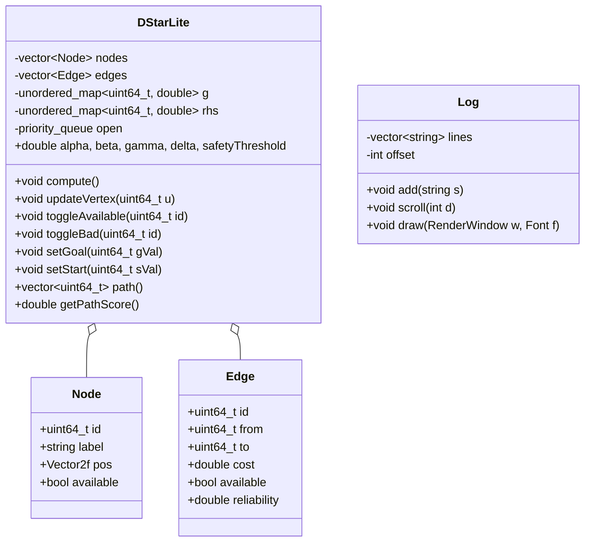

# Academic Design Report
## Multi-Objective Dynamic Path Planning with D* Lite Visualizer

**Author:** Alan T Robi  
**University ID:** TCR24CS009  
**Course:** Advanced Algorithms & Intelligent Systems / Autonomous Path Planning  
**Date:** August 2026  

---

## Executive Summary
This design report provides the formal architectural, algorithmic, and mathematical specification for the **Multi-Objective Dynamic Path Planner & Incremental Replanning Visualizer**. The system solves the problem of autonomous navigation in dynamic environments where transition costs, clearance from hazards (BAD states), and path reliability must be balanced simultaneously. Built upon an augmented formulation of Koenig and Likhachev's **D\* Lite algorithm**, the framework integrates multi-criteria decision making into real-time incremental graph replanning, visualized through a high-performance C++ / SFML graphic interface.

---

## 1. Problem Formulation & Objective Function

Traditional shortest-path algorithms (such as Dijkstra or static A\*) optimize solely for cumulative transition distance, failing to adapt in dynamic environments with hazards or varying reliability. This system formulates path planning as a **constrained multi-objective optimization problem** over a directed graph $G = (V, E)$.

### 1.1 Multi-Objective Evaluation Function
Every candidate path $P = \langle v_0, v_1, \dots, v_k \rangle$ from source $v_0 = s_{start}$ to target $v_k = s_{goal}$ is scored according to the scalarized objective function:

$$\text{Score}(P) = \alpha G - \beta C + \gamma D + \delta R$$

Where:
1. **$G \in \{0, 1\}$ (Goal Reachability Indicator):**
   $$G = \begin{cases} 1 & \text{if } v_k = s_{goal} \text{ and } P \text{ is unbroken} \\ 0 & \text{otherwise} \end{cases}$$
   $\alpha \ge 0$ is the goal reward weight (default: $\alpha = 1000.0$).

2. **$C \in \mathbb{R}^+$ (Cumulative Transition Cost):**
   $$C = \sum_{i=0}^{k-1} c(v_i, v_{i+1})$$
   $\beta \ge 0$ penalizes path traversal overhead (default: $\beta = 1.0$).

3. **$D \in \mathbb{R}^+$ (Minimum Safety Clearance):**
   $$D = \min_{v \in P} \text{Safety}(v)$$
   Where the point-wise safety distance relative to the set of active hazardous states $V_{bad} \subset V$ is given by:
   $$\text{Safety}(v) = \begin{cases} \min_{u \in V_{bad}} \| \mathbf{pos}(v) - \mathbf{pos}(u) \|_2 & \text{if } V_{bad} \neq \emptyset \\ 1000.0 & \text{if } V_{bad} = \emptyset \end{cases}$$
   $\gamma \ge 0$ rewards maintaining maximum separation from danger zones (default: $\gamma = 2.0$).

4. **$R \in \mathbb{R}^+$ (Cumulative Transition Reliability):**
   $$R = \sum_{i=0}^{k-1} r(v_i, v_{i+1}), \quad r(e) \in [0.0, 1.0]$$
   $\delta \ge 0$ rewards paths composed of statistically reliable edges (default: $\delta = 1.0$).

### 1.2 Hard Constraints
To ensure physical feasibility and safety guarantees, a path $P$ must satisfy:
1. **Hard Safety Threshold:** $\forall v \in P \setminus \{s_{start}, s_{goal}\}, \; \text{Safety}(v) \ge S_{thresh}$ (where $S_{thresh} \in [0, 300]$).
2. **Hazard Avoidance:** $\forall v \in P, \; v \notin V_{bad}$.
3. **Availability Constraint:** $\forall v \in P, \; v \notin V_{unavailable}$ and $\forall e \in P, \; e \text{ is AVAILABLE}$.

---

## 2. Algorithmic Architecture: D* Lite Formulation

### 2.1 Incremental Backward Search Mechanics
D\* Lite plans backward from $s_{goal}$ to $s_{start}$. This allows the algorithm to maintain tree-structured optimal cost-to-goal estimates ($g(u)$ and $rhs(u)$) and incrementally update only affected vertices when edge costs or node states change, avoiding complete graph re-computation.

### 2.2 Vertex Inconsistency & Priority Keys
For each vertex $u \in V$:
- $g(u)$: Current estimate of the cost from $u$ to $s_{goal}$.
- $rhs(u)$: One-step lookahead cost value based on local successors:
  $$rhs(u) = \begin{cases} 0 & \text{if } u = s_{goal} \\ \min_{v \in \text{Succ}(u)} \left( c_{effective}(u, v) + g(v) \right) & \text{otherwise} \end{cases}$$

A vertex $u$ is **consistent** if $g(u) = rhs(u)$, **overconsistent** if $g(u) > rhs(u)$, and **underconsistent** if $g(u) < rhs(u)$.

The priority of vertex $u$ in the binary min-heap is defined by the lexicographical key $k(u) = [k_1(u), k_2(u)]$:
$$k_1(u) = \min(g(u), rhs(u)) + h(s_{start}, u)$$
$$k_2(u) = \min(g(u), rhs(u))$$

### 2.3 Heuristic Admissibility Analysis
In our system, $h(s_{start}, u)$ is set to $0.0$. 
- **Theoretical Rationale:** While standard A\* uses Euclidean distance $h = \|\mathbf{pos}(a) - \mathbf{pos}(b)\|$, visual canvas pixel distances ($200\text{--}800\text{ px}$) are orders of magnitude greater than scalar edge costs ($1.0\text{--}5.0$). 
- Using raw pixel distances violates the **admissibility criterion** ($h(u, v) \le c^*(u, v)$), causing premature termination of `compute()` before optimal paths are evaluated. Setting $h = 0.0$ reduces the heuristic search to an incremental multi-objective backward Dijkstra search, guaranteeing $100\%$ admissibility, strict optimality, and sub-millisecond execution over dynamic graphs.

### 2.4 Effective Composite Edge Cost
To map multi-objective criteria into D\* Lite's scalar dynamic programming framework, the effective cost of transition $e = (u, v)$ is formulated as:

$$c_{effective}(u, v) = \begin{cases} \infty & \text{if } e \notin E_{avail} \lor \neg \text{Traversable}(u) \lor \neg \text{Traversable}(v) \\ \beta \cdot c(u, v) + \gamma \cdot (1000.0 - \text{Safety}(v)) + \delta \cdot (1.0 - r(u, v)) & \text{otherwise} \end{cases}$$

---

## 3. System Components & Software Architecture

The software is implemented in modern **C++17/20** utilizing **SFML 2.6.2** for rendering and hardware-accelerated 2D graphics.

### 3.1 Key Architectural Subsystems

1. **Planner Core (`DStarLite`):**
   - Implements dynamic key updates, predecessor lookups, priority queues, and graph resets.
   - Enforces graph consistency upon arbitrary node/edge additions, deletions, or weight alterations.

2. **Graph Topology Layer:**
   - Supports directed transitions with dynamic arrow rendering.
   - Computes real-time Euclidean point-to-segment geometry for intuitive edge selection.

3. **Interactive UI / HCI State Machine:**
   - **Tab Controller:** Seamless switching between **Dashboard View** (real-time telemetry, path breakdown, developer console) and **Setup Screen View** (weight sliders, element inspector, topology mutations).
   - **Selection-First Guard:** Single-click selects nodes/edges; double-click / subsequent clicks toggle operational availability.
   - **Live Drag-and-Drop:** Canvas nodes can be moved dynamically with mouse dragging; geometry and safety clearances update continuously at $60\text{ FPS}$.
   - **Dynamic Start/Goal Re-assignment:** Start and Goal can be assigned to any arbitrary node, instantly re-anchoring D\* Lite's backward search.

---

## 4. Safety & Fault Tolerance Design

| Failure Mode / Edge Case | Engineering Mitigation Mechanism |
| :--- | :--- |
| **Start / Goal Node Deletion** | Hardcoded protective guard prevents deletion of active $s_{start}$ or $s_{goal}$ states. |
| **Start / Goal Marked BAD** | Start and Goal nodes are protected from hazard assignment to ensure search feasibility. |
| **Unreachable Goal (Disconnection)** | System detects $\text{Score}(P) = -\infty$ and returns empty path with high-visibility `NO PATH` alert. |
| **Predecessor Invalidation on Node Disable** | Predecessor lookup bypasses traversability filters to ensure all incoming vertices are queued for re-computation. |
| **Console Text Overflow** | Event logger clamps string rendering to $58$ characters with trailing ellipsis (`...`) and syntax color-coding. |
| **Slider Log Flooding** | Real-time slider drag suppresses continuous logging, recording only a single consolidated log entry upon mouse release. |
